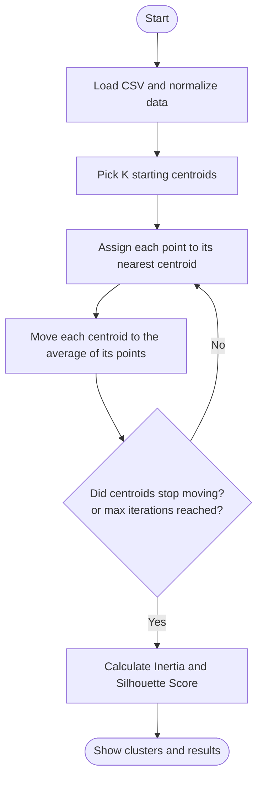

# 🧩 K-Means Clustering in C++

A simple, object-oriented C++ project that groups **mall customers** into clusters using the **K-Means algorithm**. It lets you compare two ways of choosing starting centroids (**Random** and **K-Means++**) and measure the quality of the clusters.

---

## 📌 Table of Contents

1. [What is K-Means?](#-what-is-k-means)
2. [How the Algorithm Works](#-how-the-algorithm-works)
3. [Features](#-features)
4. [Classes](#-classes)
5. [Dataset](#-dataset)
6. [How It Works in This Project](#-how-it-works-in-this-project)
7. [How to Build and Run](#-how-to-build-and-run)
8. [Using the Menu](#-using-the-menu)
9. [Metrics Explained](#-metrics-explained)
10. [Error Handling](#-error-handling)

---

## 🤔 What is K-Means?

**K-Means** is a way to automatically **group similar things together**, without anyone telling the computer what the groups are. This is called **unsupervised learning**.

**Real-life example:** A mall has 200 customers. We know each customer's *income* and *spending score*. K-Means can sort them into groups such as:

- 💰 High income, high spending
- 🛍️ Low income, high spending
- 🧘 High income, low spending
- …and so on

The mall can then plan offers for each group.

**What does "K" mean?** K is simply **the number of groups** you want. If K = 5, you get 5 clusters.

**Key words**

| Word | Simple meaning |
|------|----------------|
| **Point** | One customer (a row in the CSV) |
| **Cluster** | A group of similar points |
| **Centroid** | The center (average) of a cluster, like the "leader" of the group |

---

## 🔄 How the Algorithm Works

Imagine placing K flags on a map, then letting every person walk to their nearest flag. Then each flag moves to the middle of its crowd. Repeat until the flags stop moving.

### Step by step

| Step | What happens |
|------|--------------|
| **1. Pick K centroids** | Choose K starting points (randomly or with K-Means++) |
| **2. Assign** | Each point joins the cluster of its **nearest** centroid |
| **3. Update** | Each centroid moves to the **average** of its cluster's points |
| **4. Repeat** | Go back to step 2. Stop when centroids no longer move (or max iterations is reached) |

### Flowchart



### Picture of the idea (K = 2)

```
 Step 1: Pick centroids        Step 2: Assign points
                               
   .  .      .  .               A A      B B
   .  X       .                 A X       B
   .  .     X  .                A A     X B
      (X = centroid)               (points join nearest X)

 Step 3: Move centroids         Step 4: Repeat until stable
                               
   A A      B B                  A A      B B
   A  X      B   <- X moves     A  X      B   <- X no longer moves
   A A       X B   to center    A A       X B      DONE ✅
```

### Why Normalize?

Income might range from 15 to 137, while spending score ranges from 1 to 99. Large numbers can dominate the distance. **Normalization** rescales every column to 0–1 so all columns count equally.

### Why K-Means++?

Random starting centroids can land close together and give poor clusters. **K-Means++** picks the first centroid randomly, then prefers next centroids that are **far away** from the ones already chosen. This usually gives better and more stable results.

---

## ✨ Features

- Loads data from a CSV file
- Normalizes data (Min-Max scaling to the range 0–1)
- Two centroid initialization methods:
  - **Random Initializer**
  - **K-Means++ Initializer**
- Runs K-Means until the centroids stop moving (convergence) or the maximum iterations are reached
- Calculates **Inertia (WCSS)** and **Silhouette Score**
- **Elbow table** to help choose the best value of K
- Compares Random vs K-Means++ side by side
- Custom exceptions for clean error messages

---

## 🧱 Classes

| Class | What it does |
|-------|--------------|
| `DataPoint` | Stores one row of data (a list of numbers) and calculates the distance to another point |
| `DataSet` | Holds all the points. Loads the CSV file and normalizes the data |
| `Cluster` | Holds one centroid and the points that belong to it. Can recalculate its centroid |
| `Initializer` | Abstract base class. Defines how starting centroids are chosen |
| `RandomInitializer` | Picks K random points as starting centroids |
| `KPlusInitializer` | Picks starting centroids that are spread far apart (K-Means++) |
| `KMeans` | The main class. Runs the loop: assign points, update centroids, check convergence |
| `ClusteringMetrics` | Calculates Inertia and Silhouette Score to judge cluster quality |
| `ProjectException` | Base class for all custom errors |
| `ErrorFileOpening` | Error: CSV file cannot be opened |
| `EmptyDataSet` | Error: the dataset has no points |
| `InvalidKException` | Error: K is not valid |
| `DimensionMismatchException` | Error: points have different numbers of values |

---

## 📊 Dataset

The file `mall_customer.csv` has **200 customers** and **2 columns**:

| Annual Income (k$) | Spending Score (1-100) |
|--------------------|------------------------|
| 15 | 39 |
| 15 | 81 |
| 16 | 6 |
| 16 | 77 |

> ⚠️ The CSV must contain **only numeric columns** with one header row. Text columns (like Gender) are not supported.

---

## ⚙️ How It Works in This Project

| Algorithm step | Where it happens in the code |
|----------------|------------------------------|
| Load and normalize data | `DataSet::loadCSV()` and `DataSet::normalize()` |
| Pick K centroids | `RandomInitializer` / `KPlusInitializer` → `Initialise()` |
| Assign points | `KMeans::assignPoints()` |
| Update centroids | `KMeans::updateCentroids()` → `Cluster::updateCentroid()` |
| Check if stopped moving | `KMeans::hasConverged()` (tolerance `0.000001`) |
| Run the whole loop | `KMeans::fit()` |
| Evaluate results | `ClusteringMetrics::inertia()` and `silhouette()` |

### Random vs K-Means++

| | Random | K-Means++ |
|---|--------|-----------|
| How it picks | Shuffles points, takes first K | First is random, next ones are chosen far from existing centroids |
| Speed | Very fast | Slightly slower |
| Result quality | Can vary a lot | Usually more stable and better |

---

## 🚀 How to Build and Run

**Requirements:** `g++` (C++17) and `make`.

**Build:**

```bash
make
```

**Build and run:**

```bash
make run
```

**Clean up the compiled files:**

```bash
make clean
```

> 📂 The program reads `data/mall_customer.csv`, so run it from the project folder and keep the CSV inside a `data` folder.

---

## 🎛️ Using the Menu

```
===== MENU =====
1. Run with Random initializer
2. Run with K-Means++ initializer
3. Run with both (compare)
4. Elbow table (Random and K-Means++)
5. Exit
```

| Option | What it does |
|--------|--------------|
| **1** | Runs K-Means using Random initialization |
| **2** | Runs K-Means using K-Means++ initialization |
| **3** | Runs both and prints a comparison |
| **4** | Prints inertia for K = 1 up to your chosen K |
| **5** | Exits the program |

You will be asked for:
- **K**: number of clusters (for option 4, the largest K to test)
- **Max iterations**: limit on how many times the algorithm repeats
- **Display points?** (`y`/`n`): whether to print every point in each cluster

---

## 📏 Metrics Explained

| Metric | Meaning | Good value |
|--------|---------|------------|
| **Inertia (WCSS)** | Sum of squared distances from each point to its centroid | **Lower** is better |
| **Silhouette Score** | How well each point fits its own cluster vs. other clusters (range −1 to 1) | **Higher** is better |

💡 **Tip:** Use the **Elbow table** (option 4). Choose the K where the inertia stops dropping sharply. This "elbow" is a good number of clusters.

---

## 🛡️ Error Handling

All errors are handled with custom exceptions that inherit from `ProjectException`.

| Exception | When it happens |
|-----------|-----------------|
| `ErrorFileOpening` | CSV file cannot be opened |
| `EmptyDataSet` | The dataset has no points |
| `InvalidKException` | K is less than 1 or greater than the number of points |
| `DimensionMismatchException` | A point has a different number of values than others in a cluster |
